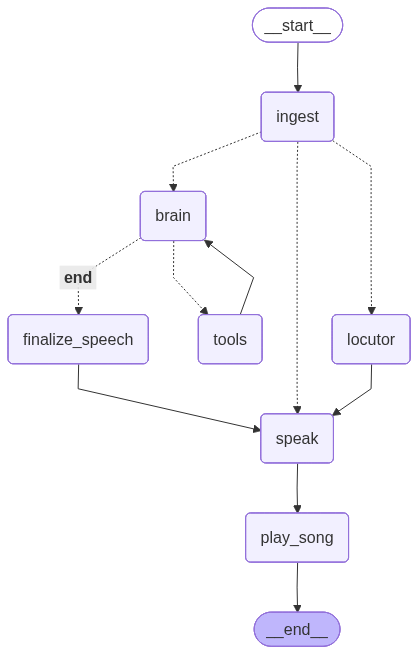

# langgraph-radio

Rádio autônoma construída com [LangGraph](https://github.com/langchain-ai/langgraph): um locutor de IA introduz músicas, lê intervenções/notícias e toca a playlist em loop contínuo.

## Como funciona

O grafo (`radio.py`) executa um ciclo por música:

1. **ingest** — monta/recarrega a playlist a partir de `mp3/`, consome arquivos `.txt` de `news/` como intervenções e prepara a próxima fala.
2. **router1** — se houver intervenção pendente, fala direto; senão escolhe entre gerar uma fala com IA (`brain`) ou usar uma fala padrão (`locutor`).
3. **brain** — o LLM (Claude) gera a fala do locutor, com acesso à ferramenta `hora_atual`.
4. **speak** — sintetiza a fala via `edge-tts` e toca.
5. **play_song** — toca a música atual até o fim.

O estado é persistido em um checkpoint SQLite (`SqliteSaver`).



## Setup

```bash
python -m venv .venv
source .venv/bin/activate
pip install -r requirements.txt
cp .env.example .env   # e preencha ANTHROPIC_API_KEY
```

Coloque arquivos `.mp3` em `mp3/`. Opcionalmente, adicione arquivos `.txt` em `news/` (cada arquivo vira uma intervenção falada).

## Uso

```bash
python radio.py
```

`Ctrl+C` para tirar a rádio do ar.
